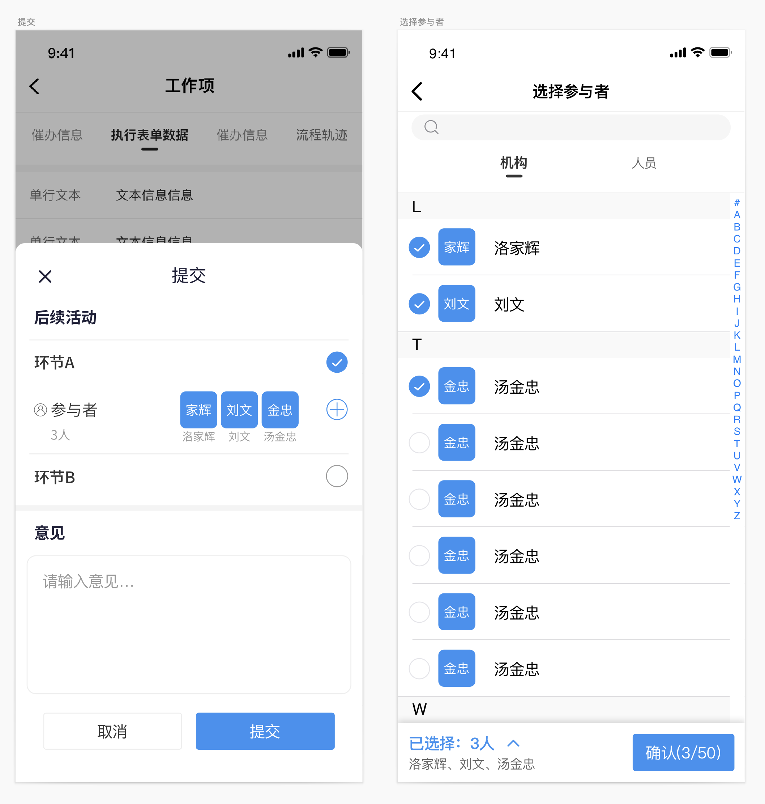
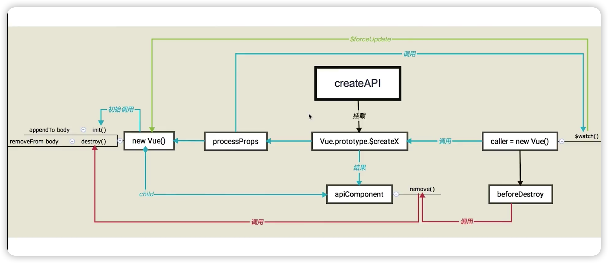

# vue-create-api 源码解析

官方文档：https://github.com/cube-ui/vue-create-api/blob/master/README_zh-CN.md

### api 简介

一个能够让 Vue 组件通过 API 方式调用的插件。

### api 使用

```javascript
import CreateAPI from 'vue-create-api'

Vue.use(CreateAPI)

// 也可以传递一个配置项

Vue.use(CreateAPI, {
  componentPrefix: 'cube-'
  apiPrefix: '$create-'
})

// 之后会在 Vue 构造器下添加一个 createAPI 方法

import Dialog from './components/dialog.vue'

// 调用 createAPI 生成对应 API，并挂载到 Vue.prototype 和 Dialog 对象上

Vue.createAPI(Dialog, true)

// 之后便可以在普通的 js 文件中使用，但是 $props 不具有响应式

Dialog.$create({
  $props: {
    title: 'Hello',
    content: 'I am from pure JS'
  }
}).show()

// 在 vue 组件中可以通过 this 调用

this.$createDialog({
  $props: {
    title: 'Hello',
    content: 'I am from a vue component'
  },
}).show()
```

### 适合的业务场景

上面描述了 `vue-create-api` 的使用，那回归到现实的业务场景中，到底怎样的业务适合使用 `vue-create-api` 呢？

其实可以简单的举几个例子，我们使用的 `Vant` 与 `ElementUI` 中的通知 `notify` ，消息提醒 `message`，轻提示 `toast`，这些组件都是支持api方式的调用，也就是说你可以直接在函数中进行调用，但站在开发的角度来看，这些组件的功能比较单一，所以一般情况下我们也就称他们为"基础组件"，因为这些组件与业务毫不相关，那开发过程中抽离的业务组件可不可以也是用api的方式来调用业务组件呢？

当然是可以的！

下面看一个真是的业务场景，



这张ui图所描述的需求是当点击图中圆形的添加按钮时会跳转到一个新的页面，新页面是一个支持选人、选机构、选部门的帮助框，当然根据传递不同的 `props` 该组件会展示不同的形态用来支持不同场景的业务。

仔细分析这个需求，我们既要想向该组件传递 `props`，又要在该组件选人结束以后监听 `$on` 该组件的事件回调，拿到选人的数据，可能你会想到可以使用路由传参，当进入这个页面时把对应的 `props`传入，选择结束以后再路由回来把数据通过路由的 `query` 携带回来。

是的，这虽然是一种方案，但这种实现会存在很多问题，首先url传参携带不了大量的数据，选人组件支持多选，数据量蛮大，其次是获取选择的数据，既然选择了路由传参这种方案就意味着始终要依赖路由钩子函数或者组件生命周期来获取路由的 `query`，你既要在进入选人组件之前的页面做这个操作也要在选人组件里做这个操作，非常麻烦。

那如果把他做成 `apiComponent` 呢？

~~~javascript
function onClick() {
  const userHelpComp = instance.proxy
  .$createUserHelp({
    $props: {
      approvalData: approval.value,
      btnData: curButton,
      processContext: formContext.value.processContext
    },
    $events: {
      onClose: () => {
        userHelpComp.hide()
      },
      onConfirm: selectData => {
        // 获取选人组件数据
      }
    }
  })
  .show()
}
~~~

现在我们把选人组件变成了一个 `apiComponent`，`show`、`hide` 函数让选人组件做显隐，`$props`向组件动态传参，`$events`  监听组件派发的事件获取组件回调数据，这样我们就完整的实现了整个组件的单向数据流，同时也解决了上面路由传参的缺点，更重要的是现在我们可以在任意一处调用选人组件了，功能相比路由传参更加强大了。

### create-api 源码分析

1. 首先是代码的入口文件，这里定义了 `install` 函数，并且向外部暴露，那么这个函数就是我们在使 `Vue.use()` 的时候调用的，这也是我们基于 `Vue` 去编写第三方插件的一个常用的做法。

   这个 `install` 方法接受两个参数，一个是大 Vue，另一个是我们给这个插件额外传一些参数，接下来该插件就会往大 Vue 上面去挂载一个函数 `createAPI`，这个函数接收的参数分别为：`component` 组件对象、`events` 事件对象(向下兼容)、`single` 是否单例。

   接下来会执行 `apiCreator` 这个函数，下面我们会继续分析。

   继续执行 `processComponentName` 函数，这个方法主要是处理组件的 name， `createName` 是什么？来看下这个函数的具体实现：

   首先从 `options` 中解构出 `componentPrefix` 和 `apiPrefix`，然后获取组件的 `name`，也就是组件的名称，如果你的组件不写 name，`assert` 会抛出一个错误，现在我们来分析 `componentPrefix` 和 `apiPrefix`，事实上 `componentPrefix` 是相对于组件库而言的，比如你使用了 `vant-notify`，那么如果你要使用 `createAPI` 的话，最终会被处理成 `createNotify`，组件的前缀会被截取掉，那 `pureName` 就是组件截取掉前缀后的名称，`camelizeName` 就是处理完成的名称。

   最后，把这个名称挂载到大 Vue 的原型上，同时也会在组件对象上挂载一个 `$create` 静态方法，这个静态方法的意义是当我们在普通的 `js` 环境中没有组件上下文的情况下只能通过 `component.$create` 这种方法去调用。

   ```javascript
   import { camelize, escapeReg, isBoolean } from "./util";
   import { assert, warn } from "./debug";
   import apiCreator from "./creator";
   import instantiateComponent from "./instantiate";

   function install(Vue, options = {}) {
     const { componentPrefix = "", apiPrefix = "$create-" } = options;

     Vue.createAPI = function (Component, events, single) {
       if (isBoolean(events)) {
         single = events;
         events = [];
       }
       const api = apiCreator.call(this, Component, events, single);
       const createName = processComponentName(Component, {
         componentPrefix,
         apiPrefix,
       });
       Vue.prototype[createName] = Component.$create = api.create;
       return api;
     };
   }

   function processComponentName(Component, options) {
     const { componentPrefix, apiPrefix } = options;
     const name = Component.name;
     assert(name, "Component must have name while using create-api!");
     const prefixReg = new RegExp(`^${escapeReg(componentPrefix)}`, "i");
     const pureName = name.replace(prefixReg, "");
     let camelizeName = `${camelize(`${apiPrefix}${pureName}`)}`;
     return camelizeName;
   }

   export default {
     install,
     instantiateComponent,
     version: "__VERSION__",
   };
   ```

2. apiCreator 的实现

   这个函数的代码比较多，我们重点关注 `api.create` 的实现，那这个方法的执行时机是什么时候呢？

   也就是当我们执行 `this.$createX` 的时候

   `create` 函数的前面都是一些参数的处理，包括 `config`、`renderFn`、`_single`，可以不用太过于关心，那 `ownerInstance` 取的值是 `this`，那这个 this 代表的是什么，这里你可以理解为调用 `$createX` 组件的上下文，在非 Vue 组件实例中是没有 `$on` 方法的，所以用 `ownerInstance.$on` 来进行判断。

   接下来是组织 `renderData`，下面来分析 `parseRenderData` 的实现。

   ```javascript
   const api = {
     before(hook) {
       beforeHooks.push(hook);
     },
     create(config, renderFn, _single) {
       if (!isFunction(renderFn) && isUndef(_single)) {
         _single = renderFn;
         renderFn = null;
       }

       if (isUndef(_single)) {
         _single = single;
       }

       const ownerInstance = this;
       const isInVueInstance = !!ownerInstance.$on;
       let options = {};

       if (isInVueInstance) {
         // Set parent to store router i18n ...
         options.parent = ownerInstance;
         if (!ownerInstance.__unwatchFns__) {
           ownerInstance.__unwatchFns__ = [];
         }
       }

       const renderData = parseRenderData(config, events);

       let component = null;

       processProps(ownerInstance, renderData, isInVueInstance, (newProps) => {
         component && component.$updateProps(newProps);
       });
       processEvents(renderData, ownerInstance);
       process$(renderData);

       component = createComponent(renderData, renderFn, options, _single);

       if (isInVueInstance) {
         ownerInstance.$on(eventBeforeDestroy, beforeDestroy);
       }

       function beforeDestroy() {
         cancelWatchProps(ownerInstance);
         component.remove();
         component = null;
       }

       return component;
     },
   };
   ```

3. parseRenderData

   实际上，这里的 `events` 是为了向下兼容，可以忽略掉，本质上这里就是要把传入 `$createX` 函数的 options，进行解构，这里只是把他放入了 `props` 中，

   ```javascript
   export default function parseRenderData(data = {}, events = {}) {
     events = parseEvents(events);
     const props = { ...data };
     const on = {};
     for (const name in events) {
       if (events.hasOwnProperty(name)) {
         const handlerName = events[name];
         if (props[handlerName]) {
           on[name] = props[handlerName];
           delete props[handlerName];
         }
       }
     }
     return {
       props,
       on,
     };
   }
   ```

   下面是对 `processProps`、`processEvents`、`process$` 的处理， 那做这些处理他的目标是什么？

   因为我们在最终去创建组件的时候，他会把 `renderData` 传入，这里你可能会疑问，这个 `renderData` 是什么？实际上这个 `renderData` 是我们 Vue 中的 `render` 函数的第二个参数，[深入数据对象](https://v2.cn.vuejs.org/v2/guide/render-function.html#%E6%B7%B1%E5%85%A5%E6%95%B0%E6%8D%AE%E5%AF%B9%E8%B1%A1)

   其实，在 Vue2.0 的版本中，我们编写组件的方式不仅只有 `template` 模板的方式，我们还可以编写 `render` 函数，这个函数会接受一个参数 `createElement`，他的第一个参数是一个节点(一个 HTML 标签名、组件选项对象)，第二个参数就是 `renderData`。

   ```javascript
   render: function (createElement) {
     return createElement('h1', this.blogTitle)
   }
   ```

   ```javascript
   const renderData = parseRenderData(config, events);

   let component = null;

   processProps(ownerInstance, renderData, isInVueInstance, (newProps) => {
     component && component.$updateProps(newProps);
   });
   processEvents(renderData, ownerInstance);
   process$(renderData);

   component = createComponent(renderData, renderFn, options, _single);
   ```

4. processProps

   上面我们做的这些都是为了构造 `renderData`，那我们来看下他是如何构造的，首先是 `processProps`

   因为在 `parseRenderData` 我们已经拿到了未处理的 `renderData` ，他的结构大致如下：

   ```javascript
   {
     $props: {
       name: "sabo";
     }
   }
   ```

   所以我们在 `processProps` 函数中直接取到了 `$props`，同时也定义了 `watchKeys` 和 `watchPropKeys` 这两个变量，他们与依赖收集相关，下面我们会继续分析，通过 Object.keys 拿到 `propKey`，这里有一个重要的判断，他判断了 `propKey` 的值如果是一个字符串并且该 `propKey` 也来自当前调用方组件的 props，那么在这将进行依赖收集，如果不是字符串，就不会做依赖收集，仅仅是赋值操作。

   接下来判断是不是在一个 Vue 组件中调用的，这时他会调用 `ownerInstance.$watch` 方法，也就是会调用 调用方的 `this.$watch` 方法，这个方法里面去观测了父组件所有 props 的变化，如果父组件的 props 发生了变化，那么就会将 `ownerInstance[watchPropKeys[i]]` 的最新值进行更新，在观测变化的过程中会执行 `onChange` 这个方法，这个方法是在执行 `processProps` 的时候传入的，

   执行完观测以后 `$watch` 会返回一个 `unwatchFn` 函数，最后在 unwatch 的时候进行解除，

   ```javascript
   function processProps(ownerInstance, renderData, isInVueInstance, onChange) {
     const $props = renderData.props.$props;
     if ($props) {
       delete renderData.props.$props;

       const watchKeys = [];
       const watchPropKeys = [];
       Object.keys($props).forEach((key) => {
         const propKey = $props[key];
         if (isStr(propKey) && propKey in ownerInstance) {
           // get instance value
           renderData.props[key] = ownerInstance[propKey];
           watchKeys.push(key);
           watchPropKeys.push(propKey);
         } else {
           renderData.props[key] = propKey;
         }
       });
       if (isInVueInstance) {
         const unwatchFn = ownerInstance.$watch(function () {
           const props = {};
           watchKeys.forEach((key, i) => {
             props[key] = ownerInstance[watchPropKeys[i]];
           });
           return props;
         }, onChange);
         ownerInstance.__unwatchFns__.push(unwatchFn);
       }
     }
   }
   ```

   上面我们说了当 props 发生变化的时候会做依赖收集以及会触发 `onChange` 回调，那这个回调又做了些什么呢？这块的实现我们将在 `createComponent` 分析。

   ```javascript
   processProps(ownerInstance, renderData, isInVueInstance, (newProps) => {
     component && component.$updateProps(newProps);
   });
   ```

5. processEvents

   ```javascript
   function processEvents(renderData, ownerInstance) {
     const $events = renderData.props.$events;
     if ($events) {
       delete renderData.props.$events;

       Object.keys($events).forEach((event) => {
         let eventHandler = $events[event];
         if (typeof eventHandler === "string") {
           eventHandler = ownerInstance[eventHandler];
         }
         renderData.on[event] = eventHandler;
       });
     }
   }
   ```

6. process$

   `process$` 函数是用来处理一些额外的数据对象，比如：`class`、`style`

   ```javascript
   function process$(renderData) {
     const props = renderData.props;
     Object.keys(props).forEach((prop) => {
       if (prop.charAt(0) === "$") {
         renderData[prop.slice(1)] = props[prop];
         delete props[prop];
       }
     });
   }
   ```

7. createComponent

   - 初始化阶段

     `createComponent` 函数支持我们传入前面构造的 `renderData`、`renderFn`、`options` 以及是否是 `single`，他返回的是一个 component 对象。

     接下来我们重点分析 `instantiateComponent` 这个函数，来分析他是如何将普通组件转换成 apiComponent 的，

     ```javascript
     function createComponent(renderData, renderFn, options, single) {
       const component = instantiateComponent(
         Vue,
         Component,
         renderData,
         renderFn,
         options
       );
       const instance = component.$parent;
       const originRemove = component.remove;

       component.remove = function () {
         if (single) {
           if (!singleMap[ownerInsUid]) {
             return;
           }
           singleMap[ownerInsUid] = null;
         }
         originRemove && originRemove.apply(this, arguments);
         instance.destroy();
       };

       const originShow = component.show;
       component.show = function () {
         originShow && originShow.apply(this, arguments);
         return this;
       };

       const originHide = component.hide;
       component.hide = function () {
         originHide && originHide.apply(this, arguments);
         return this;
       };

       if (single) {
         singleMap[ownerInsUid] = {
           comp: component,
           ins: instance,
         };
       }
       return component;
     }
     ```

     在 `instantiateComponent`函数中

     ```javascript 
     export default function instantiateComponent(Vue, Component, data, renderFn, options) {
       let renderData
       let childrenRenderFn

       const instance = new Vue({
         ...options,
         render(createElement) {
           let children = childrenRenderFn && childrenRenderFn(createElement)
           if (children && !Array.isArray(children)) {
             children = [children]
           }

           return createElement(Component, {...renderData}, children || [])
         },
         methods: {
           init() {
             document.body.appendChild(this.$el)
           },
           destroy() {
             this.$destroy()
             if (this.$el && this.$el.parentNode === document.body) {
               document.body.removeChild(this.$el)
             }
           }
         }
       })
       instance.updateRenderData = function (data, render) {
         renderData = data
         childrenRenderFn = render
       }
       instance.updateRenderData(data, renderFn)
       instance.$mount()
       instance.init()
       const component = instance.$children[0]
       component.$updateProps = function (props) {
         Object.assign(renderData.props, props)
         instance.$forceUpdate()
       }
       return component
     }
     ```

     首先他先执行了 `new Vue` 的操作，在实例化 vue 中他并没有编写 template 而是写了 render 函数，同时定义了两个 methods，因为在实例化的过程中并没有做任何的挂载，所以 render 函数也并不会执行，

     接下来又定义了 `updateRenderData` 方法，这个方法他是可以用来更新 `renderData` 的，

     接下来会执行 `$mount` 方法，执行 `$mount` 的时候 render 函数就会执行，render 函数会返回一个 vnode，然后又执行了 `instance.init`，这样这个 apiComponent 最终会渲染到 `this.$el` 上面。

     也就是说当我们执行 `this.$createXXX` 的时候，他会执行这个 `api.create` 方法，然后经过一系列数据的处理，然后调用了 `createComponent` 这个函数创建 apiComponent 组件，然后在创建 apiComponent 的过程中又会调用 `instantiateComponent`，这个函数又会做 vue 实例的初始化，$mount，init，这样就完成了一整个初始化的挂载。

   - 更新阶段

     ```javascript
     const component = instance.$children[0];
     component.$updateProps = function (props) {
       Object.assign(renderData.props, props);
       instance.$forceUpdate();
     };
     ```

     因为我们的 apiComponent 是挂载在大 Vue 下面的，所以他是大 Vue 的子组件，

     我们在这个子组件上面定义了一个 `$updateProps` 方法，那这个方法什么时候执行呢？这里先卖一个关子，下面会提到，现在我们介绍的是更新的过程，但是我们也要知道我们的 apiComponent 跟 Vue 编写的组件是不一样的，他不会走 Vue 的依赖收集那一套，所以说当数据变化了我们的 apiComponent 是不会更新的，也就是不会重新渲染，那怎样才能重新渲染呢？

     其实，前面我们已经说过了，在处理 props 的过程中，我们触发了一个 `onChange` 的回调，在这个回调里面就会调用 `component.$updateProps`，在这个方法里面会将更新后的 props 传入，然后更新 `renderData` 的 props，更新以后又调用了 `instance.$forceUpdate()`，然后 render 函数会重新执行，重新进行渲染。

   - 销毁阶段

     ```javascript
     if (isInVueInstance) {
       ownerInstance.$on(eventBeforeDestroy, beforeDestroy);
     }
     ```

     在 `api.create` 的执行过程中，监听了 `hook:beforeDestroy` ，当 beforeDestroy 钩子函数执行的时候，他会往当前实例上派发一个事件，监听到这个事件执行 `beforeDestroy`。

     ```javascript
     function beforeDestroy() {
       cancelWatchProps(ownerInstance);
       component.remove();
       component = null;
     }
     ```

     然后又会调用 `cancelWatchProps`，`unwatchFn` 是我们在 `processProps` 函数中收集的。

     ```javascript
     function cancelWatchProps(ownerInstance) {
       if (ownerInstance.__unwatchFns__) {
         ownerInstance.__unwatchFns__.forEach((unwatchFn) => {
           unwatchFn();
         });
         ownerInstance.__unwatchFns__ = null;
       }
     }
     ```

     当然，这个函数内部还执行了 `remove` 方法，忽略单例相关，这里比较重要的是 `instance.destroy`，那在这里这个 `instance` 是什么？他其实是 `new Vue` 返回的那个 instance，那当执行 `instance.destroy` 的时候，他首先会执行 `this.$destroy`，然后又做了 dom 的移除，component 置为 null，这样就完成了一次销毁。

     ```javascript
     component.remove = function () {
       if (single) {
         if (!singleMap[ownerInsUid]) {
           return
         }
         singleMap[ownerInsUid] = null
       }
       originRemove && originRemove.apply(this, arguments)
       instance.destroy()
     }

     ///////////////////////////////
     methods: {
       init() {
         document.body.appendChild(this.$el)
       },
       destroy() {
         this.$destroy()
         if (this.$el && this.$el.parentNode === document.body) {
           document.body.removeChild(this.$el)
         }
       }
     }
     ```

8. 整体流程图

   

9. 总结

   通过上面的源码分析我们可以从内部实现来学习 `create-api` 的使用，这样可以在使用的过程中规避一些低级错误，同时也能编写出更高质量的代码，同样的我们也接触了一个新的概念 **apiComponent**，也就是如何通过调用 api 的方式来调用一个组件，这一点是使用 `create-api` 的核心，因为我们一开始的诉求就是要解决如何来全局调用组件，根据这个诉求分析出我们需要这个 apiComponent 支持那些 feature，然后根据这些已知的 feature 我们才能更好的设计这个 api。

10.
